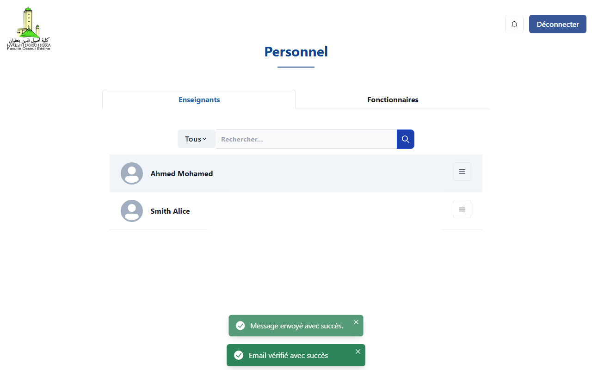
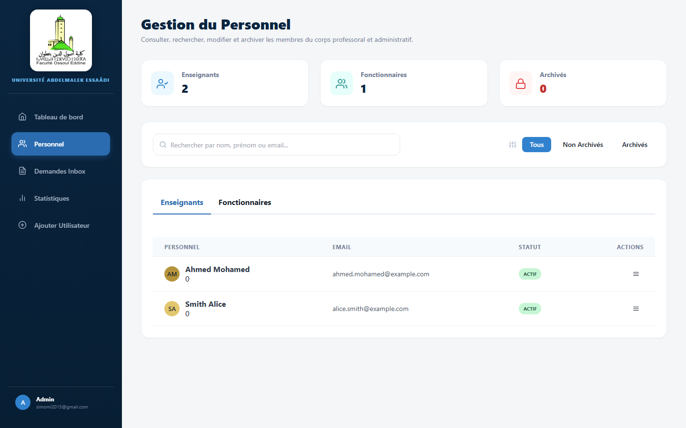
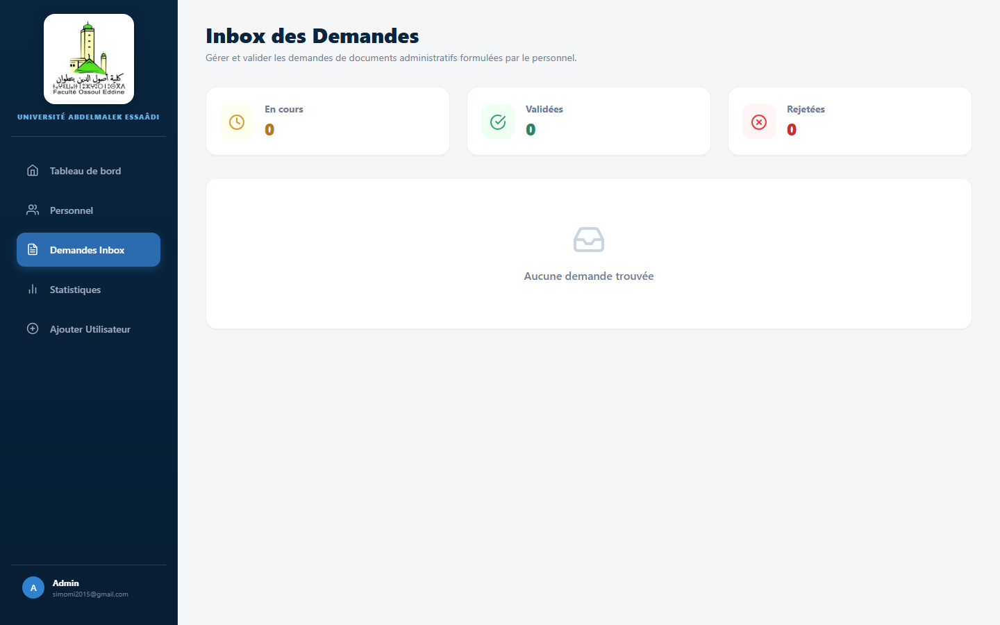
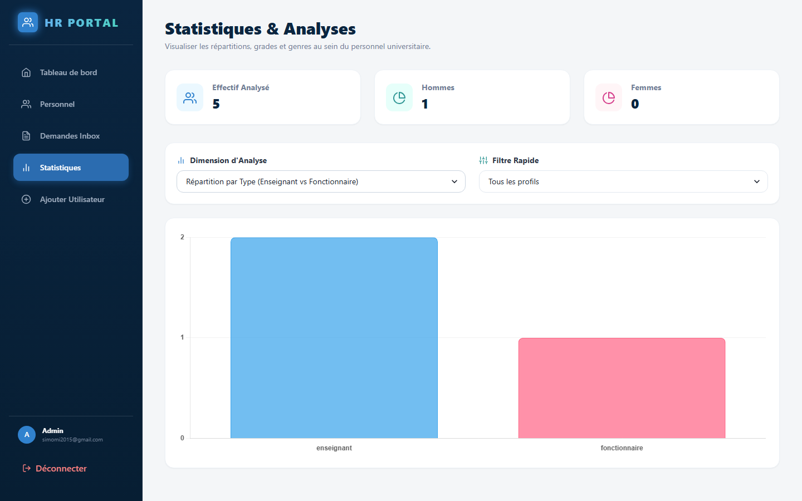

# 🎓 Système de Gestion des Ressources Humaines (HR-System) - UAE

[](https://laravel.com)
[](https://react.dev)
[](https://chakra-ui.com)
[](https://mysql.com)

Un portail moderne de gestion des ressources humaines conçu spécifiquement pour l'**Université Abdelmalek Essaâdi (UAE)**, permettant de centraliser les informations du personnel, de gérer les demandes d'attestations et d'analyser les effectifs universitaires.

---

## ✨ Fonctionnalités Majeures

### 🚪 Authentification Sécurisée (OTP)
- **Connexion par Email Professionnel** : Entrée simple sécurisée.
- **Code de vérification OTP** : Code de sécurité unique envoyé par courrier pour authentification.
- **Interface Glassmorphique** : Un design de connexion moderne et épuré.

### 📊 Tableau de bord Administrateur (UAE Dashboard)
- **Indicateurs clés de performance (KPI)** : Vue instantanée sur l'effectif (Nombre d'enseignants, fonctionnaires, etc.).
- **Flux d'activités** : Aperçu en direct des dernières demandes de documents en cours.
- **Raccourcis intelligents** : Accès rapide aux différentes sections de gestion.

### 📂 Gestion du Personnel (Directory)
- **Annuaire Interactif** : Liste détaillée des employés avec profils, grades et affectations.
- **Filtres Avancés** : Recherche dynamique par rôle ou département.
- **Gestion Complète** : Formulaire d'inscription par étapes pour ajouter facilement de nouveaux membres au personnel.

### 📥 Boîte de Réception des Demandes (Demandes Inbox)
- **Alertes en Temps Réel** : Notification instantanée à l'admin (via Toasts réactifs) lorsqu'un employé dépose une demande.
- **Traitement Dynamique** : Boutons rapides pour **Valider** ou **Rejeter** chaque dossier en un clic.
- **Impression PDF automatique** : Génération instantanée au format officiel pour impression et signature.

### 📈 Statistiques & Graphiques Interactifs
- **Analyses de Répartition** : Représentations graphiques de l'effectif par grade, genre, âge ou département.
- **Filtres Rapides** : Restructuration instantanée des graphiques selon les besoins analytiques de l'université.

---

## 🖼️ Captures d'Écran

### 🪐 Page d'Authentification (Dark Glassmorphism)


### 📈 Tableau de Bord Principal


### 👥 Annuaire du Personnel


### 📬 Inbox des Demandes d'Attestations


### 📊 Statistiques & Graphiques


---

## 🛠️ Stack Technique

* **Backend :** Laravel 11.x, Eloquent ORM, TCPDF (Génération de documents)
* **Frontend :** React 18, Vite, Chakra UI, Tailwind CSS, Redux Toolkit
* **Base de données :** MySQL
* **Tests & Automatisation :** Playwright (Vérification E2E & captures automatisées)

---

## 🚀 Installation & Lancement

### 1. Prérequis
- PHP >= 8.2
- Node.js >= 18
- MySQL / XAMPP

### 2. Cloner le projet
```bash
git clone https://github.com/BR1WA/HR-System.git
cd HR-System
```

### 3. Configurer le Backend (Laravel)
```bash
cd server
composer install
cp .env.example .env
# Configurez vos identifiants de base de données dans le fichier .env
php artisan key:generate
php artisan migrate --seed
php artisan serve
```

### 4. Configurer le Frontend (Vite + React)
```bash
cd ../client
npm install
npm run dev
```
Accédez ensuite à l'application sur [http://localhost:5173](http://localhost:5173).

---

## 🤝 Contribution

1. Forkez le projet.
2. Créez votre branche de fonctionnalité : `git checkout -b feature/ma-fonctionnalite`
3. Commitez vos modifications : `git commit -m 'feat: description de ma fonctionnalité'`
4. Poussez sur la branche : `git push origin feature/ma-fonctionnalite`
5. Ouvrez une Pull Request.
